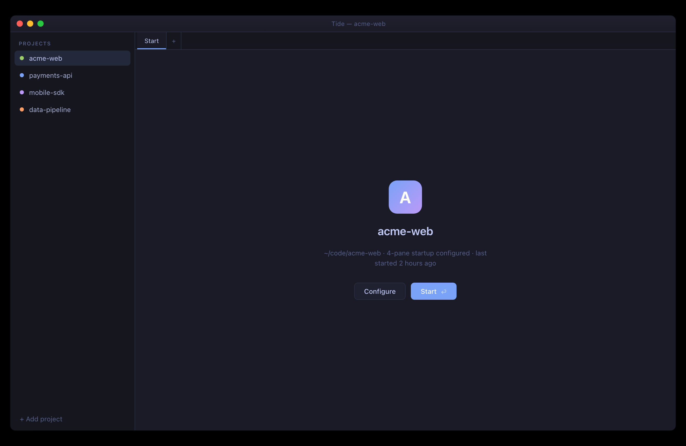
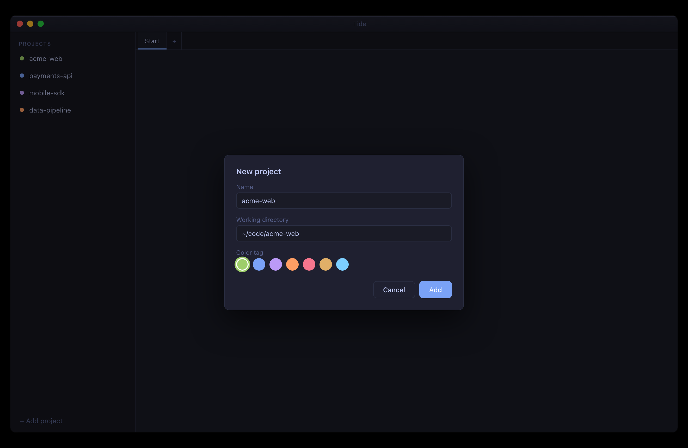
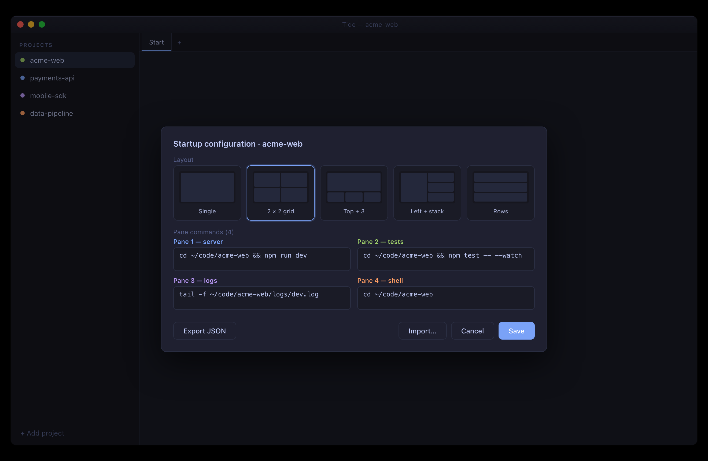
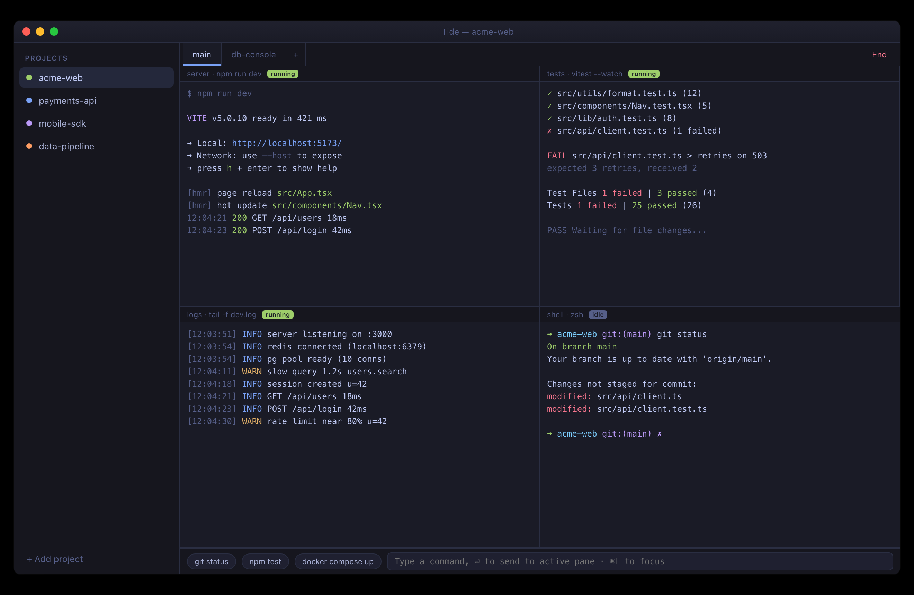
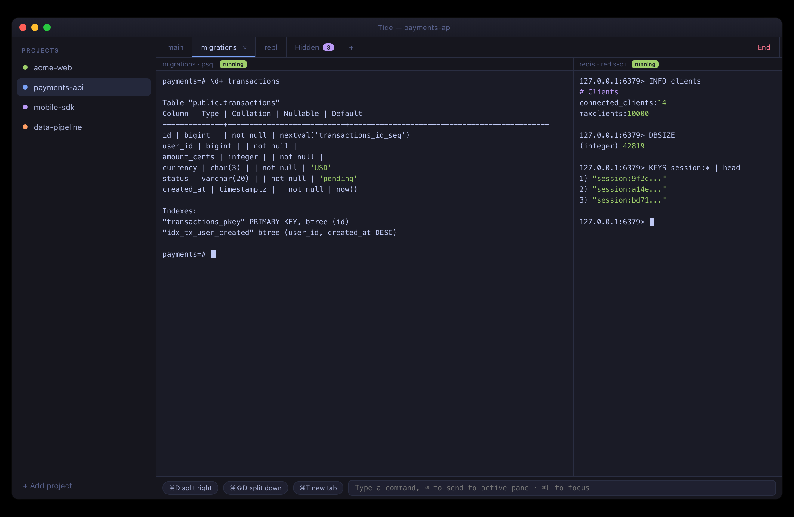
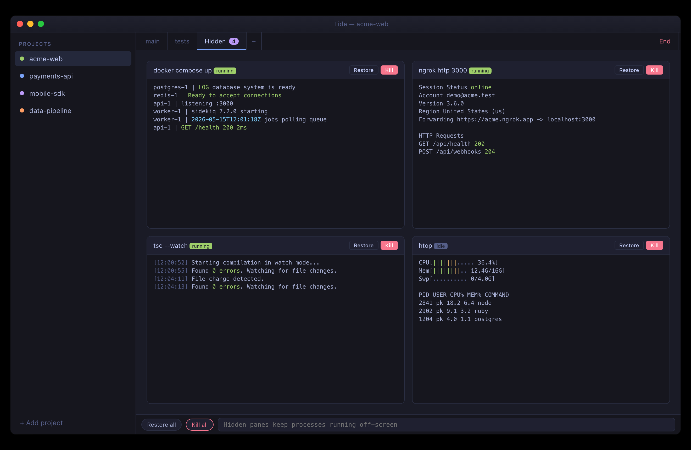
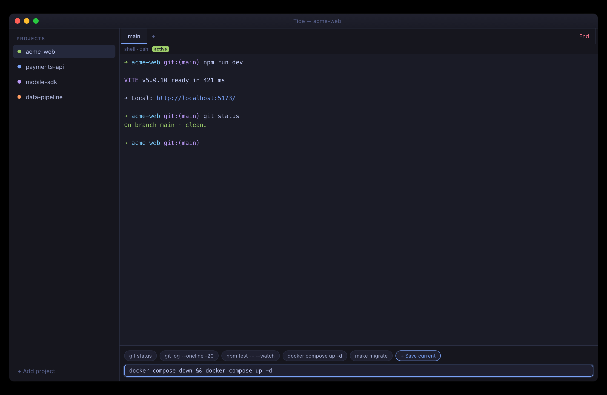
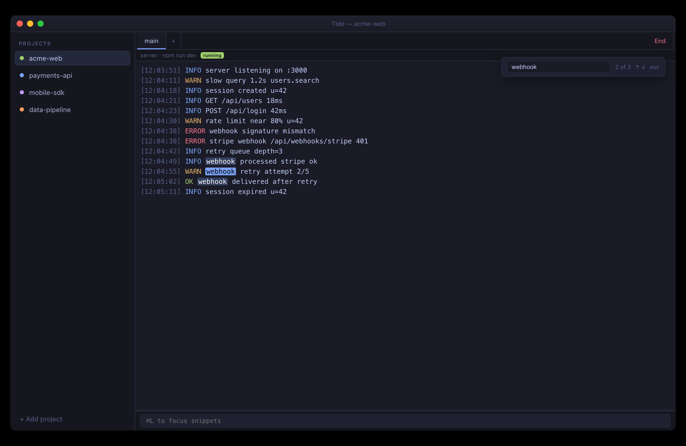

# Tide Tutorial

Project-oriented macOS terminal. This walks through the full workflow: install → add a project → configure startup → launch → splits, tabs, hidden panes, snippets, find.

> All screenshots below are UI mockups rendered from `mockups/*.html` — they show the real layout and styling without pulling in personal data.

---

## 1. Install

Requires macOS 14+ and Xcode 16+ (Swift 6).

```bash
git clone git@github.com:spkprav/tide.git
cd tide
make install        # builds release + copies Tide.app to /Applications
```

Other targets:

| Command          | What                                             |
|------------------|--------------------------------------------------|
| `make build`     | Release build → `./Tide.app` (no install)        |
| `make debug`     | Debug build                                      |
| `make run`       | Build + launch                                   |
| `make uninstall` | Remove `/Applications/Tide.app`                  |
| `make clean`     | Wipe `.build/` and `Tide.app`                    |
| `make reset`     | `clean` + drop `.swiftpm/` and `Package.resolved`|

First launch may need right-click → Open (Gatekeeper). The `install` target also strips the quarantine attribute, so a fresh `make install` usually opens directly.

---

## 2. Start screen

Every project opens to a Start screen. Nothing runs until you press **Start**. This is by design — no accidental command execution when you click a project.



- Left sidebar: your projects, colour-tagged, drag to reorder.
- Status line under the project name: working directory, pane count, last-run hint.
- **Configure** edits the startup config. **Start** (or `⏎`) launches it.

---

## 3. Add a project

Click **+ Add project** at the bottom of the sidebar.



- **Name** — display only.
- **Working directory** — used as `cwd` for every pane unless overridden.
- **Color tag** — for the sidebar dot.

Stored as JSON at `~/Library/Application Support/Tide/projects.json`. Hand-editable.

---

## 4. Configure startup

Click **Configure** on a project's Start screen.



**Layout** picker (5 presets):

```
┌─────┐  ┌──┬──┐  ┌─────┐  ┌──┬──┐  ┌─────┐
│     │  │  │  │  │  1  │  │  │ 2│  │  1  │
│  1  │  ├──┼──┤  ├──┬──┤  │ 1├──┤  ├─────┤
│     │  │  │  │  │2│3│4│  │  │ 3│  │  2  │
│     │  │  │  │  │ │ │ │  │  ├──┤  ├─────┤
│     │  │  │  │  │ │ │ │  │  │ 4│  │  3  │
└─────┘  └──┴──┘  └──┴─┴──┘ └──┴──┘  └─────┘
 Single   2 × 2    Top + 3   Left+   Rows
                              stack
```

**Pane commands** — one shell command per pane. Run inside the project's working directory by default.

**Export / Import JSON** — share startup configs between machines. Stored at `~/Library/Application Support/Tide/startups.json`.

Press **Save** then **Start**.

---

## 5. Running layout

A 2×2 grid spun up:



- Each pane has a title bar (auto-pulled from escape sequences, so `zsh`/`vim`/`ssh` set them automatically) and a running/idle pill.
- **Double-click pane title** → zoom that pane to fullscreen. Double-click again → unzoom.
- Drag dividers to resize. Each column in 2×2 has its own row divider (independent).
- **End** (top right) → SIGINT → SIGTERM → SIGKILL the whole process group, then return to Start screen.

---

## 6. Tabs and splits

Beyond the startup config, mid-session you can:

- `⌘T` — new tab inside the project
- `⌘D` — split right
- `⌘⇧D` — split down
- `⌘W` — close pane or tab



Tabs are per-project. The "Hidden" tab (with a count badge) holds panes you've moved off-screen but kept running.

---

## 7. Hidden panes

Right-click any pane → **Hide**. The process keeps running but the pane disappears. Click the **Hidden** tab to see them in a live grid:



From there: **Restore** brings a pane back to a new tab, **Kill** ends it. Use this for long-lived daemons (Docker, ngrok, `tsc --watch`) that you don't want cluttering your active layout.

---

## 8. Snippets bar

Persistent input row at the bottom (`⌘L` to focus). Type a command, press Enter — sent to the active pane. Save snippets per-project or globally.



Stored at `~/Library/Application Support/Tide/snippets.json`. Same format, hand-editable, exportable.

---

## 9. Find in scrollback

`⌘F` opens SwiftTerm's built-in find bar on the active pane.



Arrow keys cycle matches. `Esc` to dismiss.

---

## 10. Keyboard cheatsheet

| Action                       | Shortcut             |
|------------------------------|----------------------|
| New tab                      | `⌘T`                 |
| Split right                  | `⌘D`                 |
| Split down                   | `⌘⇧D`                |
| Close pane / tab             | `⌘W`                 |
| Find in pane                 | `⌘F`                 |
| Focus snippets bar           | `⌘L`                 |
| Start (on Start screen)      | `⏎`                  |
| Zoom pane                    | Double-click title   |

---

## Storage layout

| File                                                       | What                          |
|------------------------------------------------------------|-------------------------------|
| `~/Library/Application Support/Tide/projects.json`         | Project list                  |
| `~/Library/Application Support/Tide/startups.json`         | Per-project startup configs   |
| `~/Library/Application Support/Tide/snippets.json`         | Saved snippets                |

All JSON. Backed up, diffed, version-controlled however you like.

---

## Regenerating the mockup screenshots

```bash
CHROME="/Applications/Google Chrome.app/Contents/MacOS/Google Chrome"
cd mockups
for f in 01-start-screen 02-add-project 03-configure-startup 04-running-2x2 \
         05-tabs-splits 06-hidden-tab 07-snippets 08-find; do
  "$CHROME" --headless --disable-gpu --hide-scrollbars \
    --window-size=1320,860 --force-device-scale-factor=2 \
    --screenshot="../assets/docs/${f}.png" "file://$(pwd)/${f}.html"
done
```
